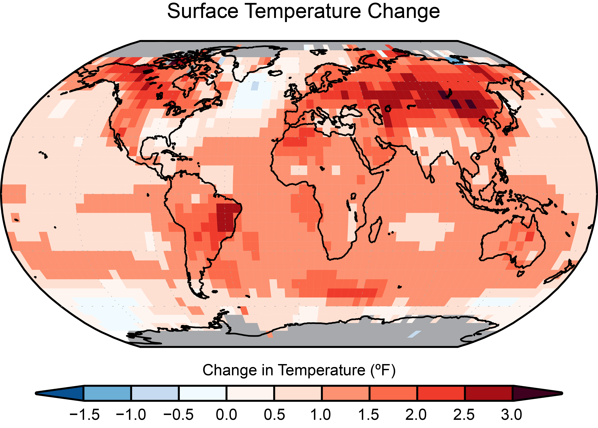

# Innovation's Carbon Footprint: The Climate Impact of Tech Growth

An interactive data visualization dashboard that explores the complex relationship between technological innovation, industrial growth, and climate change.



## Project Overview

This dashboard provides a comprehensive analysis of how industrial growth and tech-centric countries impact carbon emissions and global temperatures. It examines the "flip side" of innovation through climate data, exploring both the benefits of technology and its environmental costs.

## Key Features

- **CO2 Emissions Analysis**: Track carbon emission trends across continents and time periods
- **Economic Impact Visualization**: Explore the relationship between GDP, technology adoption, and carbon footprints
- **Tech-Climate Correlation**: Analyze how tech-heavy economies correlate with emissions and temperature changes
- **Interactive Scenario Building**: Create custom future emission scenarios based on AI adoption, renewable energy, and efficiency improvements
- **Policy Effectiveness Comparison**: Compare different climate policies across multiple dimensions

## Core Technologies & Libraries

- **Panel**: Framework for creating interactive web applications and dashboards
- **HoloViews**: High-level data visualization library for complex data
- **Plotly**: Interactive plotting library for advanced visualizations
- **Bokeh**: Interactive visualization library for modern web browsers
- **Pandas & NumPy**: Data manipulation and analysis
- **Param**: Declarative parameterization for building interactive applications

## Data Sources

This project integrates multiple high-quality climate and economic datasets:

1. **Our World in Data – CO₂ and Greenhouse Gas Emissions Dataset**
   - Global data on carbon dioxide emissions, GDP, population, and energy consumption from 1750 onwards
   - Source: https://github.com/owid/co2-data

2. **Berkeley Earth – Global Land Temperatures by Country**
   - Historical temperature data by country, dating back to 1743
   - Source: https://berkeleyearth.org/data/

3. **Carbon Intensity Estimates (Based on IPCC Global Averages)**
   - Approximate global average carbon emissions (in gCO₂/kWh) for various energy sources
   - Source: IPCC Sixth Assessment Report (AR6) - https://www.ipcc.ch/report/ar6/wg3/

## Core Principles

This dashboard is built around several key principles:

1. **Data-Driven Analysis**: Relying on scientific datasets to illustrate climate trends
2. **Interactive Exploration**: Enabling users to interact with data through sliders, tabs, and scenario builders
3. **Multifaceted Approach**: Examining the climate-technology relationship from multiple angles
4. **Educational Focus**: Presenting complex climate data in an accessible, visual format
5. **Future-Oriented**: Including projections and scenario planning tools

## Installation & Setup

1. Clone this repository
2. **Create and activate a virtual environment (crucial):**
   ```
   # On macOS/Linux
   python -m venv venv
   source venv/bin/activate
   
   # On Windows
   python -m venv venv
   venv\Scripts\activate
   ```
3. Install required dependencies:
   ```
   pip install -r requirements.txt
   ```
4. Run the application:
   ```
   python main.py
   ```

> **Note:** Using a virtual environment is crucial for this project to ensure dependency isolation and prevent conflicts with other Python projects or system packages. The visualization libraries have specific version requirements that might conflict with other installed packages.

## Project Structure

- `main.py`: The primary application code containing all visualizations and dashboard logic
- `requirements.txt`: Required Python packages
- `bibliography.txt`: Data sources and references
- `GlobalLandTemperaturesByCountry.csv`: Temperature data file
- `climate_day.png` & `climate_impact.png`: Visualization images

## How to Use

The dashboard is organized into multiple tabs:
- **CO2 Emissions**: View global and continental emission trends
- **Economy & Carbon**: Explore relationships between economic indicators and emissions
- **Carbon Sources**: Analyze different sources of carbon emissions
- **Tech vs Emissions**: Examine correlations between technology adoption and carbon footprints
- **Future Scenarios**: Explore potential future emission trajectories
- **Create Your Scenario**: Build custom emission scenarios with adjustable parameters
- **Policy Analysis**: Compare effectiveness of various climate policies

Use the time controls in the sidebar to adjust the time period for analysis.

## License

[Specify your license information here]

## Contributors

[Add contributor information here]
